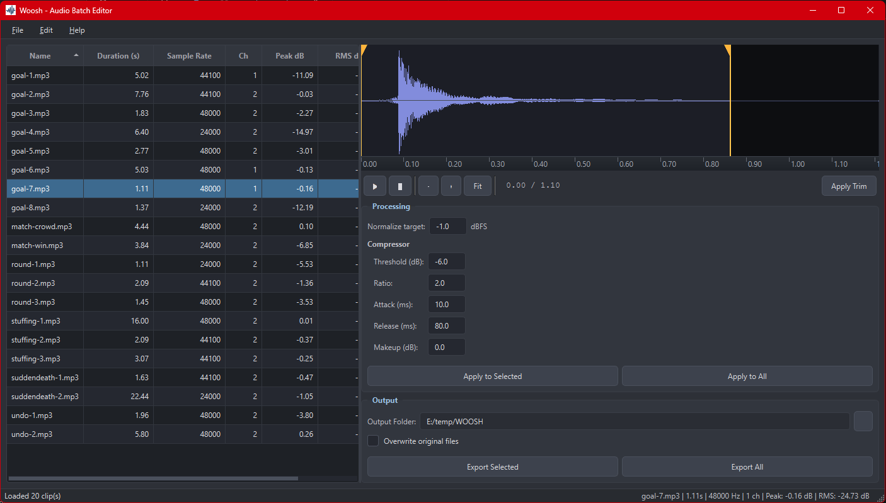

# Woosh

A Qt 6 desktop utility for game audio teams to batch-trim, normalize, and lightly compress WAV/MP3 assets. First iteration focuses on non-destructive edits and WAV export; MP3 export will be added later.



## Features (current)
- Open WAV and MP3 files (decode via libsndfile + mpg123).
- View basic metadata (duration, sample rate, channels, peak/RMS).
- Apply trim, peak/RMS normalize, and a simple compressor in-memory.
- Batch process folders; export processed clips as WAV with `_woosh` suffix.
- Minimal GUI: file list, placeholder waveform, batch dialog, and per-clip controls.

## Roadmap / TODO
- Add MP3 export via LAME.
- Add OGG/FLAC support (libogg/libvorbis/libFLAC).
- Replace placeholder waveform with real visualization.
- Loudness normalization (EBU R128/LUFS).
- More robust test coverage and headless pipelines.

## Dependencies

Woosh uses CMake, a standalone Qt 6 install, and vcpkg for the audio
dependencies.

- **Qt 6**: Install Qt 6 with the **MSVC 2022 64-bit** kit, e.g. to
  `C:\Qt\6.10.1\msvc2022_64`. Make sure this path matches the
  `CMAKE_PREFIX_PATH` used in `CMakePresets.json` (by default
  `C:/Qt/6.10.1/msvc2022_64`).
- **vcpkg**: Used for audio libraries only.
  - `vcpkg.json` in the repo declares:
    - `libsndfile`
    - `mpg123` (without default features)
  - Triplet: `x64-windows`.
  - Either enable `vcpkg integrate install` or set `VCPKG_ROOT` so that
    CMake/vcpkg can find the toolchain file
    (`%VCPKG_ROOT%/scripts/buildsystems/vcpkg.cmake`).

You generally don’t need to run `vcpkg install` manually if your environment
is configured to auto-restore from `vcpkg.json`, but you can run it from the
repo root if necessary.

## Building

Woosh is configured for a **preset-based CMake workflow** that works well with
Visual Studio 2022/2026 and the Qt install in `C:\Qt`.

### Option 1: CMake presets (CLI)

From the repository root:

```bash
# Configure Debug
cmake --preset x64-debug

# Build Debug
cmake --build --preset x64-debug

# Configure Release
cmake --preset x64-release

# Build Release
cmake --build --preset x64-release
```

The presets in `CMakePresets.json` use the `Visual Studio 17 2022` generator,
set the vcpkg toolchain file from `VCPKG_ROOT`, configure the target triplet
`x64-windows`, and point `CMAKE_PREFIX_PATH` at your Qt install
(`C:/Qt/6.10.1/msvc2022_64` by default).

### Option 2: Visual Studio 2022 / 2026

1. Open the folder in Visual Studio.
2. VS picks up `CMakePresets.json` automatically.
3. Select a CMake configuration such as `x64-Debug` or `x64-Release`.
4. Build the `Woosh` target from the CMake Targets view.

Notes:
- Ensure `VCPKG_ROOT` is set or vcpkg is integrated so the toolchain file
  resolves correctly.
- On Windows, `Woosh` is built as a GUI application (no console). The CMake
  build integrates `windeployqt` to copy required Qt DLLs after building,
  as long as the tool is found in your Qt installation.

## Running
- From CMake build dir: `build\Debug\Woosh.exe` (or `Release`).
- Drop a few WAV/MP3 files into a `samples/` folder and open them via File → Open Folder.
- Exported files are saved alongside originals with `_woosh` suffix by default.

## Tests

Woosh has simple assert-style tests compiled into the `WooshTests` executable.

Using CMake presets:

```bash
# Debug tests
cmake --build --preset x64-debug --target WooshTests
ctest --preset x64-debug

# Release tests
cmake --build --preset x64-release --target WooshTests
ctest --preset x64-release
```

## Limitations (current)
- MP3 export not implemented (decode only).
- Waveform view is a placeholder.
- Preview playback uses Qt Multimedia; may need extra codecs on some systems.

## Structure
```
Woosh/
  src/
    ui/
    audio/
    utils/
  resources/
  tests/
```

## License

Woosh is licensed under the **GNU General Public License v3.0 (GPL-3.0)**.

This means you are free to use, modify, and distribute this software, provided that any derivative works are also licensed under GPL-3.0.

See [LICENSE](LICENSE) for the full license text.

## Author

**Pedro G. Dias** ([@digitaldias](https://github.com/digitaldias))


